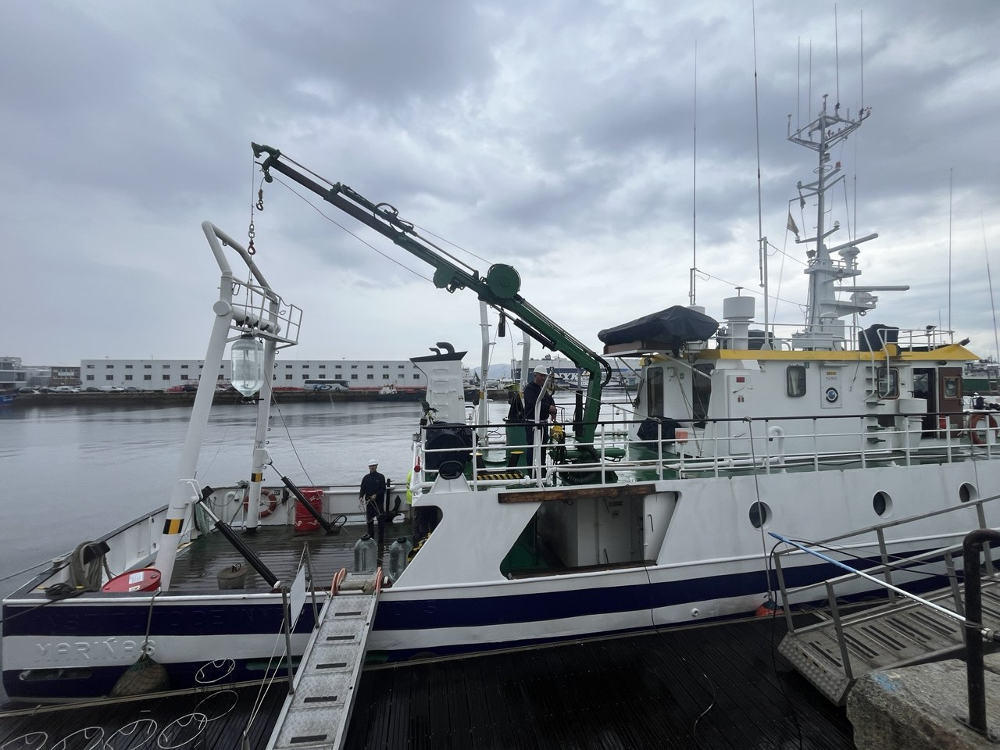
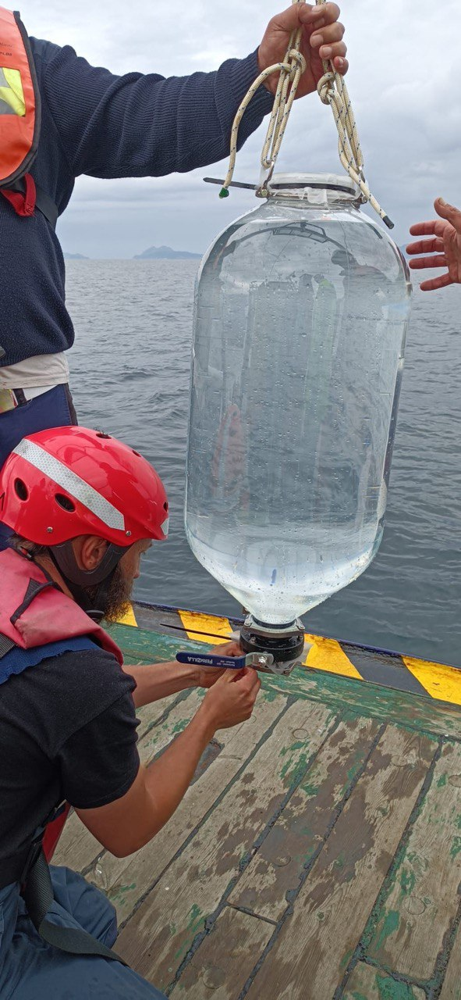
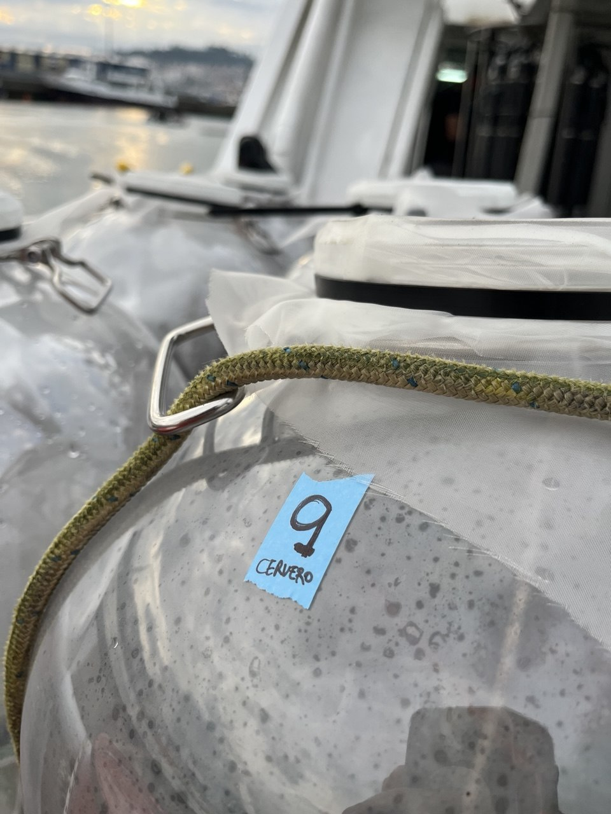
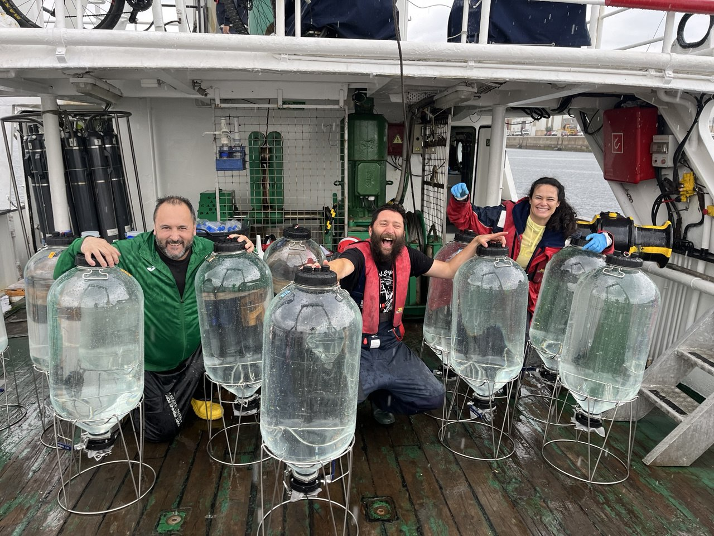

# Ocean alkalinity enhancement pelagic impact in the Northwest Iberian Upwelling System under nutrient limited conditions


Marcos Fontela<sup>1</sup>, María Froján<sup>1</sup>, Belén Arbones<sup>1</sup>, María Jesús Álvarez-Fernández<sup>1</sup>, Caio Cesar-Ribeiro<sup>2</sup>, Marylo Doval<sup>3</sup>, José Luís Garrido<sup>1</sup>, Sara Groppelli<sup>4</sup>, María López-Acosta<sup>1</sup>, María López-Rodriguez<sup>1</sup>, Celeste L. Hinojo<sup>1</sup>, Blanca Marigómez<sup>1,5</sup>, Laura Moreno<sup>6</sup>, Fíz F. Pérez<sup>1</sup>, Isabel Gomes Teixeira<sup>1</sup>, Antón Velo<sup>1</sup>, Xosé Antonio Padin<sup>1</sup>

<sup>1</sup> Instituto de Investigaciones Marinas (IIM), CSIC, 36208 Vigo, Spain
<sup>2</sup> CCMAR Centre of Marine Sciences, Universidade do Algarve, Campus de Gambelas, 8005-139 Faro, Portugal
<sup>3</sup> INTECMAR, Vilagarcía de Arousa, Spain
<sup>4</sup> Department of Earth and Environmental Sciences (DISAT), University of Milano-Bicocca, Piazza della Scienza, 20126 Milano, Italy
<sup>5</sup> Universidade de Vigo, Vigo, Spain
<sup>6</sup> University of Aveiro, Aveiro, Portugal

Correspondence: Marcos Fontela — <mfontela@iim.csic.es>

> **Status: this manuscript is currently under peer review.** The analysis and the
> figures produced by this repository may still change in response to the review
> process. Please check back for the final version before relying on these results.

---

## Overview

This repository holds the code that reproduces the results of the OAEPIIP Vigo
microcosm experiment (Ría de Vigo, NW Iberian Upwelling System, 9–28 May 2025),
part of the **Ocean Alkalinity Enhancement Pelagic Impact Intercomparison
Project (OAEPIIP)**.

Nine replicated microcosms (54.5 L, n = 3 per treatment) enclosing a natural
plankton community were exposed to two hydroxide-based alkalinity enhancement
treatments — *unequilibrated* and *equilibrated* — and a *control*, and
monitored daily for 20 days.

A single script, [`OAEPIIP_publication_code.R`](OAEPIIP_publication_code.R),
starts from the published data file and reproduces:

| Output | Content |
| --- | --- |
| **Figure 2** | Temperature and the inorganic carbon system (TA, pH<sub>T</sub>25, DIC, *p*CO<sub>2</sub>, Ω<sub>aragonite</sub>) |
| **Figure 3** | Dissolved inorganic nutrients and stoichiometric ratios |
| **Figure 4** | Chlorophyll *a*, POC, BSi and PON |
| **Figure 5** | Microplankton abundance by functional group and biomass composition by genus |
| **Figure 6** | Plankton groups resolved by flow cytometry |
| **Table 2** | GAMM model selection (best model, adjusted R², AIC) and estimated marginal means |

## Data

The experiment data report (`OAEPIIP_Vigo_data_report.xlsx`) is archived at
digital.CSIC and is **not redistributed here**:

> 🔗 **<https://digital.csic.es/handle/10261/000000>**
> *(placeholder — the final handle and DOI will be added once the dataset record is public)*

Download the workbook and place it next to the script, or edit the `DATA_FILE`
line at the top of the script to point at it.

The workbook has one sheet per measurement block (`TA`, `Carbchem`, `T_S_L`,
`Nutrients`, `Chla`, `POCPON`, `BSi`, `FlowCyto`, `Microscopy`) plus a `ReadMe`
sheet documenting every variable, its units, the analytical method and its
expected uncertainty. All sheets share the keys `day`, `microcosm` and
`treatment`.

## Quick start

```r
# 1. install the dependencies (once)
install.packages(c("readxl", "dplyr", "tidyr", "stringr", "purrr", "tibble",
                   "forcats", "ggplot2", "patchwork", "ggtext", "ggh4x",
                   "scales", "mgcv", "emmeans", "multcomp"))

# 2. run everything
source("OAEPIIP_publication_code.R")
```

Everything is written to `OAEPIIP_output/`: the five figures as vector PDFs and
`Table_2_GAMM_results.csv`. Set `RUN_GAMM <- FALSE` at the top of the script to
build only the figures and skip the model fitting, which takes a few minutes.

The script is self-contained: it reads only the Excel workbook, has no hidden
state and no dependency on any other file in this repository. Taxon-to-functional
group assignments and all analytical choices are written explicitly in the code.

## Requirements

R ≥ 4.1 and the packages listed above. Developed and tested on R 4.5.2. Figures
are written with `cairo_pdf`, available in the standard R distribution on all
platforms.

## Citation

If you use this code or the data, please cite the original work.

**Paper (under review):**

> Fontela, M., Froján, M., Arbones, B., Álvarez-Fernández, M. J., Cesar-Ribeiro, C.,
> Doval, M., Garrido, J. L., Groppelli, S., López-Acosta, M., López-Rodriguez, M.,
> Hinojo, C. L., Marigómez, B., Moreno, L., Pérez, F. F., Gomes Teixeira, I.,
> Velo, A., and Padin, X. A.: Ocean alkalinity enhancement pelagic impact in the
> Northwest Iberian Upwelling System under nutrient limited conditions,
> *under review*, 2026.

**Dataset:**

> Fontela, M. et al.: OAEPIIP Vigo May 2025 experiment data report,
> digital.CSIC, https://digital.csic.es/handle/10261/000000, 2026.


This work follows the methodological framework of the OAEPIIP technical note [(Bach et al., 2024)](https://bg.copernicus.org/articles/21/3665/2024/).

## Acknowledgements

The authors thank the SACUIM unit at IIM-CSIC for their valuable help with the experimental setup, and the R/V *Mytilus* crew for their invaluable collaboration and expertise during the microcosm filling process.

<p align="center">
  
  
  
  
</p>

<p align="center">
  <sub>
    <em>Left to right:</em> R/V <em>Mytilus</em> alongside in Vigo · a microcosm being
    filled from the base at the sampling site · a labelled microcosm with the 200 µm
    mesh fitted · the filled microcosms on deck before transport to the incubation
    room. Ría de Vigo, 9 May 2025.
  </sub>
</p>

## License

Code released under CC BY 4.0. The data are distributed under the license stated
in their digital.CSIC record.

## Contact

Marcos Fontela — <mfontela@iim.csic.es> — Instituto de Investigaciones Marinas
(IIM-CSIC), Vigo, Spain
